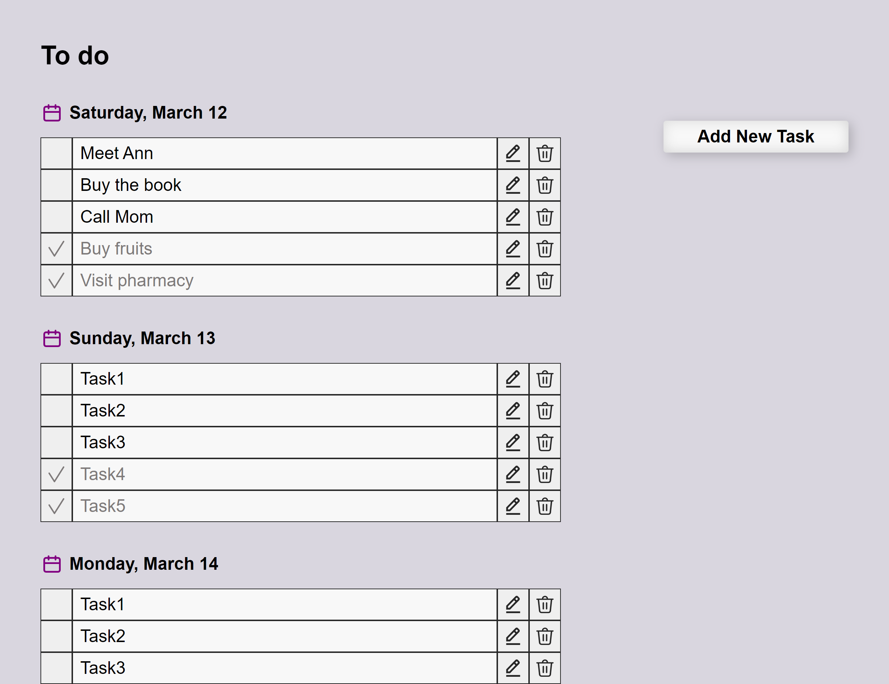

# Multi-User Todo App Using Vanilla JavaScript

## Installation

```bash
git clone https://github.com/fundakartal/todo-app.git
cd todo-app
npm install or yarn install
```

## Start the server

```bash
gulp
```

Now enter [`localhost:3000`](http://localhost:3000) in the address bar of your browser.

### Screenshot


